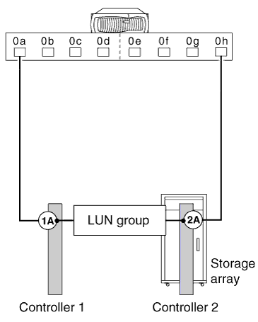

= Prise en charge de configurations DAS avec les baies de stockage E-Series
:allow-uri-read: 
:icons: font
:imagesdir: ../media/

[role="lead"]
Vous pouvez connecter des systèmes ONTAP dans des configurations à connexion directe aux baies de stockage E-Series. Vous devez vérifier la redondance des connexions entre les systèmes ONTAP et les baies de stockage pour éviter la possibilité d'un point de défaillance unique. FlexArray Stretch MetroCluster prend en charge les configurations à connexion directe avec les baies de stockage E-Series. Pour plus d'informations, reportez-vous aux sections, https://mysupport.netapp.com/matrix["Matrice d'interopérabilité NetApp"] et https://docs.netapp.com/us-en/ontap-metrocluster/install-stretch/index.html["Installation et configuration d'Stretch MetroCluster"].

La matrice d'interopérabilité contient des informations sur les modèles de baies E-Series spécifiques pris en charge dans des configurations à connexion directe avec le système ONTAP.

ONTAP prend en charge les configurations à connexion directe suivantes avec les baies de stockage E-Series :

== Configuration de base autonome

Dans une configuration de base autonome, deux ports initiateurs FC du système ONTAP accèdent aux ports d'un groupe de LUN de baie à deux ports.

L'illustration suivante présente une configuration à connexion directe dans laquelle les ports initiateurs FC ONTAP 0a et 0h accèdent aux ports cibles d'un groupe LUN de baie à deux ports :

== Groupe de LUN de baie à quatre ports

Deux ports initiateurs FC sur chaque système ONTAP d'une paire haute disponibilité accèdent à différents ports de baie de stockage dans un groupe de LUN de baie à quatre ports pour assurer la redondance des connexions.

L'illustration suivante présente une configuration à connexion directe dans laquelle les ports initiateurs FC ONTAP accèdent aux ports cibles d'un groupe LUN Array à quatre ports.

image::../media/da_4port_hapair.gif[da 4port hapair]

Vous pouvez également connecter quatre ports initiateurs FC depuis chaque système ONTAP de la paire haute disponibilité vers deux groupes LUN de baies à quatre ports différents, de sorte que chaque port initiateur FC d'une paire de ports accède au groupe LUN secondaire.

L'illustration suivante montre une configuration à connexion directe dans laquelle les ports initiateurs FC ONTAP accèdent aux ports cibles de deux groupes LUN Array à quatre ports :

image::../media/direct_attached_configuration_with_two_four_port_array_lun_groups.gif[configuration à connexion directe avec deux groupes lun de baie à quatre ports]

== Groupe de LUN de baie de huit ports

Quatre ports initiateurs FC sur chaque système ONTAP d'une paire haute disponibilité accèdent à différents ports de baie de stockage dans un groupe de LUN de baie de huit ports pour assurer la redondance des connexions.

L'illustration suivante montre une configuration à connexion directe dans laquelle les ports initiateurs FC ONTAP accèdent aux ports cibles d'un groupe LUN Array huit ports :

image::../media/eight_port_direct_attached_ha_pair_configuration.gif[configuration d'une paire haute disponibilité à connexion directe à huit ports]
