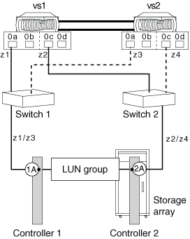

= Partage d'un port cible avec deux ports FC initiator
:allow-uri-read: 
:icons: font
:imagesdir: ../media/

[role="lead"]
Un maximum de deux ports initiateurs FC ONTAP sur les nœuds peut être connecté à un port cible unique sur la baie de stockage. Cette configuration est prise en charge avec les configurations MetroCluster dans ONTAP.

Cette configuration est prise en charge pour une utilisation avec toutes les baies de stockage répertoriées dans la matrice d'interopérabilité, comme prise en charge pour la version de ONTAP exécutée sur votre système.

L'illustration suivante montre une configuration de port cible partagé avec une paire haute disponibilité. Le partage d'un port cible avec deux ports FC initiator est pris en charge avec les systèmes autonomes et les paires haute disponibilité.

[NOTE]
====
Pour plus d'informations sur le partage d'un port FC initiator avec plusieurs ports cibles et un zoning, reportez-vous au document _FlexArray Virtualization installation Requirements and Reference_

====

== Port cible partagé connecté aux ports FC initiator

L'exemple suivant montre une paire haute disponibilité dans laquelle un port cible unique se connecte à deux ports FC initiator :

Les ports d'initiateur 0a des contrôleurs vs1 et vs2 sont connectés au port 1A de la matrice de stockage et les ports 0C des contrôleurs sont connectés au port 2A de la matrice de stockage.

*Informations connexes*

https://mysupport.netapp.com/matrix["Matrice d'interopérabilité NetApp"]

https://docs.netapp.com/us-en/ontap-flexarray/install/index.html["Conditions requises pour l'installation et référence de la virtualisation FlexArray"]

https://docs.netapp.com/us-en/ontap-metrocluster/install-fc/index.html["Installation et configuration de la solution Fabric-Attached MetroCluster"]
