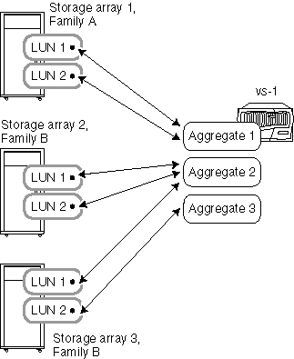

= Règles d'agrégation lorsque les baies de stockage proviennent de fournisseurs ou de familles différents
:allow-uri-read: 
:icons: font
:imagesdir: ../media/

[role="lead"]
Des règles spécifiques s'appliquent à la façon dont vous pouvez placer des LUN de baie dans des agrégats lorsque les baies de stockage proviennent de différents fournisseurs ou de différentes familles de baies de stockage d'un même fournisseur.

Les règles suivantes s'appliquent si vos baies de stockage proviennent de fournisseurs différents ou de familles différentes d'un même fournisseur :

* Vous ne pouvez pas combiner des LUN de baie à partir de baies de stockage de différents fournisseurs ou de familles de différents fournisseurs, dans un même agrégat.
* Vous pouvez associer l'agrégat contenant le volume root à n'importe quelle baie de stockage, quel que soit le type de famille de la baie de stockage.

[NOTE]
====
Lors de la création de l'agrégat, veillez à spécifier explicitement les ID des LUN de baie que vous souhaitez ajouter à l'agrégat. N'utilisez pas les paramètres pour spécifier le nombre et la taille des LUN de baie à récupérer, car le système peut récupérer automatiquement des LUN d'une autre famille ou d'une baie de stockage d'un autre fournisseur. Lorsque les LUN de baie de différentes familles ou fournisseurs se trouvent dans le même agrégat, la seule façon de résoudre le problème des LUN de baie mixtes dans un agrégat consiste à détruire l'agrégat et à le recréer.

====
Les exemples suivants montrent des options pour la disposition des LUN de baie dans des agrégats lorsque les baies de stockage proviennent de _différents fournisseurs ou de familles provenant du même fournisseur_.

== Exemple 1 : les LUN des deux baies de stockage se trouvent dans des agrégats différents

Dans cet exemple, certaines LUN pour ONTAP proviennent de la baie de stockage 1, famille A, tandis que les autres LUN pour ONTAP proviennent de la baie de stockage 2, famille B. les LUN des deux baies de stockage ne peuvent pas être ajoutées au même agrégat, car les deux baies de stockage proviennent de familles différentes d'un même fournisseur. Il en serait de même si les deux baies de stockage provenaient de fournisseurs différents.

image::../media/luns_assigned_to_multiple_aggrs_dif_family.gif[Ce graphique est décrit par le texte environnant.]

== Exemple 2 : certaines LUN peuvent être mixtes dans le même agrégat et d'autres ne le peuvent pas

Dans cet exemple, une baie de stockage appartient à la famille A et les deux autres à la famille B. les LUN de la baie de stockage de la famille A ne peuvent pas être ajoutées au même agrégat que les LUN d'une baie de stockage de la famille B, car les baies de stockage appartiennent à des familles différentes. Toutefois, la LUN 1 de la baie de stockage 3 peut être attribuée à l'agrégat 2, qui contient également des LUN de la baie de stockage 2, car les deux baies de stockage font partie de la même famille.

