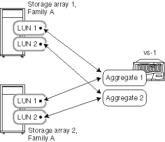

= Règles d'agrégation lorsque les baies de stockage appartiennent à la même famille
:allow-uri-read: 
:icons: font
:imagesdir: ../media/

[role="lead"]
Des règles spécifiques s'appliquent à la façon dont vous pouvez placer des LUN de baie dans des agrégats lorsque les baies de stockage proviennent du même fournisseur de baie de stockage et de la même famille de modèle.

Si vos baies de stockage proviennent du même fournisseur, les règles pour l'ajout de LUN de baie à des agrégats sont les suivantes :

* Vous pouvez mélanger des LUN de baies à partir des baies de stockage du même agrégat si les baies de stockage font partie de la même famille.
* Vous pouvez séparer les LUN de baie en différents agrégats.

Les exemples suivants présentent certaines options de configuration des LUN de baie dans des agrégats lorsque les baies de stockage derrière un système ONTAP appartiennent à _la même famille de fournisseur_.

[NOTE]
====
Pour plus de simplicité, les illustrations ne montrent que deux baies de stockage ; votre déploiement peut inclure davantage de baies de stockage.

====

== Exemple 1 : ajout de LUN de toutes les baies de stockage à un seul agrégat

Comme illustré ci-dessous, vous pouvez créer un agrégat, puis ajouter toutes les LUN de toutes les baies de stockage de la même famille au même agrégat :

image::../media/luns_assigned_to_same_aggr_same_family.gif[Ce graphique est décrit par le texte environnant.]

== Exemple 2 : distribution et association de LUN des baies de stockage sur plusieurs agrégats

Comme illustré ci-dessous, vous pouvez créer plusieurs agrégats, puis distribuer et combiner les LUN de baie des différentes baies de stockage de la même famille sur les agrégats :

[NOTE]
====
Cet exemple n'est pas pris en charge si vous avez des matrices de stockage du même modèle et si l'une est équipée de lecteurs Fibre Channel et que l'autre matrice de stockage est équipée de disques SATA. Dans ce cas, ces baies de stockage ne sont pas considérées comme appartenant à la même famille.

====