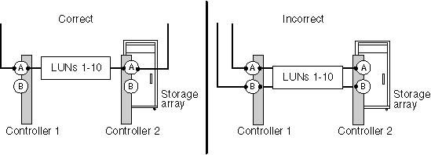

= Tous les chemins d'accès à une LUN de baie se trouvent sur le même contrôleur de baie de stockage
:allow-uri-read: 
:icons: font
:imagesdir: ../media/

[role="lead"]
ONTAP ne prend pas en charge la configuration de tous les chemins vers le même contrôleur de matrice de stockage, car cela configure une configuration avec un point de défaillance unique (SPOF). La `storage errors show` commande identifie toute LUN de baie dont les chemins sont configurés pour aller au même contrôleur de matrice de stockage.

ONTAP ne vous permet pas d'attribuer des LUN de baie à un système ONTAP tant que vous n'avez pas résolu cette erreur.

== Les erreurs de stockage affichent le message

[listing]
----
NAME (UID): All paths to this array LUN are connected to the same fault domain. This is a single point of failure
----

== Explication

Cette erreur se produit parce que les chemins vers une LUN de baie sont configurés pour aller vers le même contrôleur de baie de stockage ou FRU.

[NOTE]
====
L'utilisation de quatre chemins vers une LUN de baie, une baie de stockage avec des FRU à plusieurs directeurs (tels qu'EMC Symmetrix ou HDS USP) ou une baie de stockage avec deux contrôleurs (comme EMC CX ou HP EVA) sont de bonnes méthodes pour assurer la redondance. Toutefois, si vous configurez les chemins d'accès via un seul contrôleur de baie de stockage ou une seule unité remplaçable sur site, vous configurez votre configuration avec un SPOF, même avec de telles fonctionnalités. Sur une baie de stockage actif-actif, la totalité du FRU est considérée comme un domaine de panne. Une baie de stockage EMC Symmetrix, par exemple, possède plusieurs directeurs de canal sur la même carte FEBE. Une carte FEBE est considérée comme un domaine de panne car si tous les chemins passent par la même carte FEBE, vous perdez tous les chemins si vous devez remplacer la carte.

====
L'illustration suivante montre une sélection de port de matrice de stockage correcte et incorrecte pour la configuration de chemins redondants vers une LUN de matrice de sorte que vous n'ayez pas de domaine de panne unique. La configuration du chemin dans l'exemple de gauche est correcte car les chemins d'accès à la LUN de la baie sont redondants, chaque connexion étant reliée à un port d'un autre contrôleur de la baie de stockage. Dans l'exemple de droite, les deux chemins vers la LUN de la baie sont vers le même contrôleur, qui configure un SPOF.

 `storage errors show`La commande affiche la LUN de la baie qui se trouve dans le même domaine de pannes. Vous pouvez également voir ce problème dans la `storage disk show` sortie si vous regardez la colonne TPGN (numéro de groupe de ports cible). Un TPGN différent doit être affiché pour chaque initiateur d'une paire de ports initiateurs. Si le TPGN est le même pour les deux initiateurs de la paire, les deux initiateurs se trouvent dans le même domaine de pannes.

L'exemple suivant `storage disk show` montre TPGN 1 pour la LUN 30, accessible via les initiateurs 0a et 0C. Si les chemins sont redondants, chaque initiateur affiche un TPGN différent.

[listing]
----

mysystem1::> storage disk show mysystem1:vgbr300s70:9.126L30
                  Disk: HP-1.15
        Container Type: unassigned
            Owner/Home: -  / -
               DR Home: -
                 Array: HP_HSV450_1
                Vendor: HP
                 Model: HSV450
         Serial Number: 600508B4000B63140000800001660000
                   UID: 600508B4:000B6314:00008000:01660000:00000000:...
                   BPS: 512
         Physical Size: -
              Position: present
Checksum Compatibility: block
             Aggregate: -
                  Plex: -
Paths:
                     LUN Initiator Side   Target Side
Controller Initiator ID  Switch Port      Switch Port     Acc Use  Target Port      TPGN...
---------- --------- --- ---------------- --------------- --- ---  ---------------- -----
mysystem1    0c      30  vgci9148s75:1-12 vgci9148s75:1-9 AO  RDY  50014380025d1509   1
mysystem1    0a      30  vgbr300s70:12    vgbr300s70:9    AO  INU  50014380025d1508   1

Errors:
HP-1.15 (600508b4000b63140000800001660000): All paths to this array LUN are connected to the same fault domain. This is a single point of failure.
----
[NOTE]
====
L'UID complet dans cet exemple est 600508B4:000B6314:00008000:01660000:00000000:00000000:00000000:00000000:00000000:00000000. Il est tronqué dans l'exemple en raison de l'espace.

====

== Dépannage et résolution des problèmes

Les chemins d'accès à l'unité logique de la baie doivent être reconfigurés de manière à ce qu'ils soient utilisés pour les unités remplaçables sur site ou les contrôleurs de la baie de stockage redondante.

. Ajoutez un câble au port cible redondant de l'autre contrôleur.
+
Vous devez maintenir la redondance lors de la résolution de ce problème en ajoutant un câble au contrôleur secondaire _avant_ vous retirez un câble du contrôleur avec le SPOF. Dans ce cas, la redondance est maintenue car vous augmentez temporairement le nombre de chemins vers trois au lieu de réduire le nombre de chemins vers un pendant que vous résolvant le problème.

. Retirez un câble du contrôleur configuré avec le SPOF.
+
Vous disposez désormais de deux chemins redondants vers la LUN de la baie.

. Depuis la ligne de commande ONTAP, entrez de nouveau la commande suivante et confirmez que l'erreur a été corrigée : `storage errors show`

