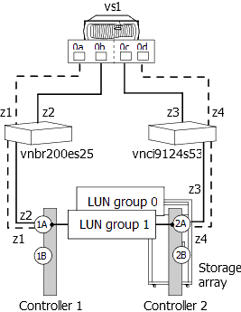

= ID de LUN dupliqués sur un port cible
:allow-uri-read: 
:icons: font
:imagesdir: ../media/

[role="lead"]
Chaque LUN de baie sur le même port cible de baie de stockage doit avoir un ID de LUN unique. Le résultat de cette `storage errors show` commande identifie les LUN présentées avec le même ID de LUN sur le même port cible.

== Les erreurs de stockage affichent le message

[listing]
----

NAME (UID), port WWPNx: LUN x occurs more than once.  LUNs cannot be reused on the same array target port.
----

== Explication

La cause habituelle des ID de LUN dupliqués sur un port cible est une erreur de zoning. Un administrateur place les initiateurs FC des systèmes ONTAP dans différents groupes hôtes pour créer plusieurs LUN groupes sur une baie de stockage, mais commet une erreur de segmentation qui permet aux initiateurs des différents groupes hôtes d'accéder au même port cible.

Lorsque ce type d'erreur de zoning est effectué, `storage array config show` le résultat de la commande affiche deux LUN groups avec les mêmes ports cibles.

== Scénario de problème

L'administrateur souhaite mapper quatre LDEV (a, b, c et d) pour l'utilisation de ONTAP, deux LDEV dans chacun des deux groupes de LUN. Pour ce scénario, supposons que la baie de stockage présente les LDEV aux ports initiateurs sans tenir compte du port cible par lequel l'initiateur accède aux matrices de stockage ; autrement dit, les groupes d'hôtes sont _non_ spécifiques à un port cible. La segmentation doit être utilisée pour créer des groupes de LUN en contrôlant quels ports cibles sont accessibles par chaque initiateur.

[NOTE]
====
Pour certaines baies de stockage, telles que HP EVA, les groupes d'hôtes sont les mêmes pour tous les ports cibles. Pour les autres baies de stockage, telles que Hitachi, les groupes d'hôtes sont spécifiques à un port cible.

====
L'administrateur configure correctement deux groupes hôtes, comme suit, de sorte qu'il existe deux groupes LUN :

|===
| Groupe d'hôtes | Initiateurs FC dans le groupe hôte | LDEV et ID de LUN associés 

 a| 
1
 a| 
0a0c
 a| 
LDEV a/LUN 1LDEV b/LUN 2

 a| 
2
 a| 
0b 0d
 a| 
LDEV c/LUN 1LDEV d/LUN 2

|===
La segmentation doit être configurée comme suit :

* Les initiateurs des groupes hôtes 1, 0a et 0C doivent être zonés sur les paires de ports cibles 1A et 2A.
* Les initiateurs des groupes hôtes 2, 0b et 0d doivent être zonés sur les paires de ports cibles 1B et 2B.

Notez dans le tableau précédent que LDEV a et LDEV c ont tous deux le même ID de LUN (L1). De même, LDEV b et LDEV d ont tous deux le même ID de LUN (L2). Si la segmentation est correctement configurée, cette duplication d'ID de LUN n'est pas un problème, car la réutilisation d'ID de LUN sur différents ports cibles est prise en charge.

Le problème dans ce scénario est que certains initiateurs sont placés dans la mauvaise zone lorsque la segmentation est configurée, comme indiqué dans le tableau suivant :

|===
| Zone | Système ONTAP |  | Baie de stockage |  

 a| 
Commutateur vnbr200es25

 a| 
z1
 a| 
vs1
 a| 
Port 0a
 a| 
Contrôleur 1
 a| 
Orifice 1A

 a| 
z2
 a| 
vs1
 a| 
Orifice 0b
 a| 
Contrôleur 1
 a| 
Port 1A (au lieu de 1B)

 a| 
Commutateur vnci9124s53

 a| 
z3
 a| 
vs1
 a| 
Orifice 0C
 a| 
Contrôleur 2
 a| 
Orifice 2A

 a| 
z4
 a| 
vs1
 a| 
Port 0d
 a| 
Contrôleur 2
 a| 
Port 2A (au lieu de 2B)

|===
L'illustration suivante montre le résultat de l'erreur de segmentation :

Comme vous pouvez le voir dans l'illustration, deux groupes de LUN sont créés. Cependant, en raison de l'erreur de zoning, les LUN group 0 et LUN group 1 se trouvent sur la même paire de ports cibles (1A et 2A), au lieu d'un LUN group se trouvant sur chaque paire de ports cibles.

Le résultat suivant `storage array config show` de cet exemple montre deux LUN Group. Le problème est que les deux LUN groups ont les mêmes ports cibles.

[listing]
----

vs1::> storage array config show

       LUN    LUN
Node  Group  Count  Array Name   Array Target Ports     Switch Port   Initiator
----- ----- ------- -----------  -------------------    ----------    ---------

 vs1    0       2   DGC_RAID5_1  20:1A:00:a0:b8:0f:ee:04  vnbr200es25:5  0a
                                 20:2A:00:a0:b8:0f:ee:04  vnci9124s53:6  0c
        1       2   DGC_RAID5_1  20:1A:00:a0:b8:0f:ee:04  vnbr200es25:5  0b
                                 20:2A:00:a0:b8:0f:ee:04  vnci9124s53:6  0d

Warning: Configuration were errors detected.  Use 'storage errors show' for detailed information.
----
Le résultat suivant `storage errors show` de cet exemple identifie les LUN présentant le problème :

[listing]
----

vs1::> storage errors show

Disk: EMC-1.1
UID: UID-a
----------
EMC-1.1 (UID-a), port WWPN1: LUN 1 occurs more than once.  LUNs cannot be reused on the same array target port.

Disk: EMC-1.2
UID: UID-b
----------
EMC-1.2 (UID-b), port WWPN1: LUN 2 occurs more than once.  LUNs cannot be reused on the same array target port.

Disk: EMC-1.3
UID: UID-c
----------
EMC-1.3 (UID-c), port WWPN2: LUN 1 occurs more than once.  LUNs cannot be reused on the same array target port.

Disk: EMC-1.4
UID: UID-d
----------
EMC-1.4 (UID-d), port WWPN2: LUN 2 occurs more than once.  LUNs cannot be reused on the same array target port.
----
Dans cet `storage errors show` exemple, vous pouvez voir que les UID des quatre LDEV sont affichés, mais qu'il n'y a que deux ID de LUN uniques, LUN 1 et LUN 2. au lieu de quatre.

== Dépannage et résolution des problèmes

L'administrateur de la matrice de stockage doit corriger le zoning afin que les initiateurs des différents groupes hôtes n'aient pas accès au même port cible.

. Dans le `storage array config` résultat, recherchez les initiateurs qui parlent au même port cible.
. Entrez la commande suivante pour afficher les détails de l'erreur : `storage errors show`
. Déterminez le LDEV pour lequel les ID de LUN sont dupliqués.
. Pour chaque port cible du contrôleur 1 qui a plusieurs initiateurs du même système ONTAP qui lui sont mappés, modifiez le zoning de sorte que les deux initiateurs FC ne parlent pas_ au même port cible.
+
Vous effectuez cette étape car les initiateurs de différents groupes hôtes ne doivent pas se trouver dans la même zone. Vous devez effectuer cette étape sur un initiateur à la fois afin qu'il existe toujours un chemin vers la LUN de la baie.

. Répéter la procédure sur le contrôleur 2.
. Entrez `storage errors show` dans ONTAP et confirmez que l'erreur a été corrigée. ``

